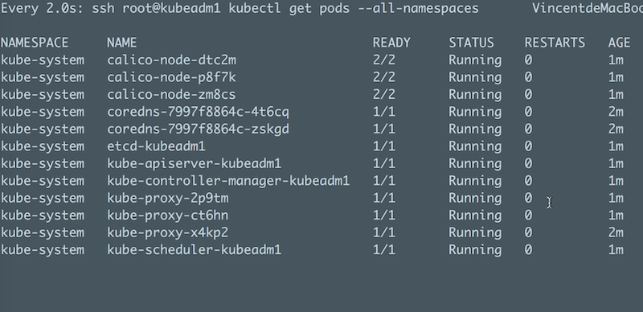

# kubeadm offline installer

目前支持到 1.1.0。

|组件|版本|
|---|---|
|Kubernetes|1.10|
|Docker|1.12.3|
|Calico|3.0.4|
|CoreDNS|1.0.6|

没有好的完整的网络连接，Kubernetes 是很难搞的。

这里给出一个离线安装的 Release，尽量跟踪更新最新版本，给网络没那么方便的朋友们拿来玩。

[Kubeadm](https://kubernetes.io/docs/setup/independent/install-kubeadm/) 是一个很方便的搭建
Kubernetes 集群的方法。

每次部署一个新集群，按照官网文档一次一次的 `cat xxx EOF `， `yum install xxx`，非常低效，
所以我做了这个 Playbook。目前仅在 CentOS 7 Minimal 版本上运行测试过，并且可以在没有互联网的
情况完成部署。

不喜欢或者不会使用的朋友也可以在 Files 目录中找到所需要的镜像或 rpm 包。

## 用法

`ansible-playbook -i hosts/hosts.sample -u root cluster.yml`

1. 需要 2.4.0 以上版本的 ansible。
2. 从 [Releases 页](https://github.com/fleeto/kubeadm-offline-installer/releases) 下载和解压所需版本。
3. 编写 Host 文件，分组方式可以参考 `hosts/hosts.sample`。
4. `group_vars/all` 中有部分可以修改的变量。
5. 运行脚本。
6. `/usr/local/bin` 目录下会生成初始化和加入集群的脚本。
7. `/etc/kubernetes` 目录中包含证书和配置文件。
8. 玩去吧您。

## 特点

1. 离线、离线，还是离线。
2. 支持不同设置的 lvm 设置。
3. 包含了 Calico 网络插件。

---

> Setup a cluster with kubeadm, without internet connections.

- Upgraded to v1.10.0

|Component|Version|
|---|---|
|Kubernetes|1.10|
|Docker|1.12.3|
|Calico|3.0.4|
|CoreDNS|1.0.6|

[Kubeadm](https://kubernetes.io/docs/setup/independent/install-kubeadm/) is a
great way to set up a kubernetes cluster.

But every time I'm setting up a new cluster with it, I have to keep the internet
connection, and do something like
`cat xxx EOF `, `yum install xxx`, when kubeadm finished, I still have to copy
config file, ca certs and save the tokens. this is boring, so I composed this
playbook, working for minimal CentOS 7, can install a cluster without internet.

## Usage

`ansible-playbook -i hosts/hosts.sample -u root cluster.yml`

1. install ansible version >= 2.4.0
2. Download and extract bin package from [Releases tab](https://github.com/fleeto/kubeadm-offline-installer/releases)
3. Write down ip in the hosts file, here is a sample in `hosts/hosts.sample`.
4. Change the variables in `group_vars/all`.
5. Run the playbook.
6. You can find init/join script in `/usr/local/bin`.
7. Configuration files are stored in Master node's `/etc/kubernetes`
8. Enjoy it.

## Features

1. Offline.
2. Support for different lvm configuration in CentOS.
3. Calico plugins included.
